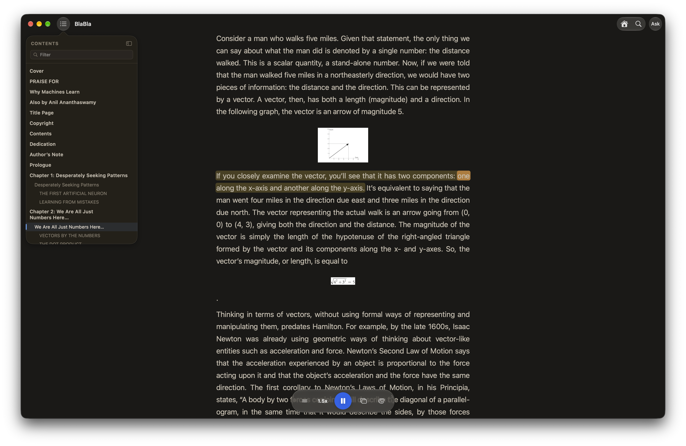

<p align="center">
  
</p>

<h1 align="center">BlaBla</h1>

<p align="center">
  A private, on-device reader for macOS that reads your books and documents aloud.<br>
  Powered by the Supertonic 3 text-to-speech model running on Metal and the Neural Engine.
</p>

<p align="center">
  <a href="../../releases/latest">Download</a> · <a href="#build-from-source">Build from source</a> · <a href="LICENSE">MIT License</a>
</p>



## Features

**Document reader**
- Opens PDF, EPUB, MOBI/AZW, DOCX, Markdown, TXT, web pages (paste a URL) and clipboard text.
- Word-by-word karaoke highlighting with auto-scroll. Double-click any sentence to start reading from there.
- Table of contents sidebar, find in book (⌘F), and pinch-to-zoom text.
- Remembers where you left off in every document.
- Floating mini player that stays on top of other windows.
- Now Playing and media-key support.
- Ask questions about the book you're reading, answered on-device by Apple Intelligence with cited passages.
- 11 voices, 1×–2× speed, six reading themes.

**Menu-bar reader**
- Select text in any app and press **⌥⌘R** to hear it.

**Private by design**
- Speech synthesis, document parsing and search all run locally. Nothing is uploaded.

## Install

1. Download `BlaBla.zip` from the [latest release](../../releases/latest) and unzip it.
2. Move `Blabla.app` to `/Applications`.
3. The app is not notarized, so the first launch is blocked by Gatekeeper. Either right-click the app and choose **Open**, or run:
   ```bash
   xattr -dr com.apple.quarantine /Applications/Blabla.app
   ```
4. For the menu-bar reader, grant Accessibility access when asked (needed to read the selected text).

**Requirements:** a Mac with Apple Silicon running macOS 26.5 or later. Ask requires Apple Intelligence.

## Performance

Measured on an M2 Max, Release build, speed 1×, 8 flow-matching steps, steady state (median of 6 runs).

| Sentence | Audio | Metal only | Metal + Neural Engine | RTF (Metal → ANE) |
|---|---:|---:|---:|---:|
| Short (16 chars) | 1.6 s | 368 ms | **58 ms** | 4.4× → **27.6×** |
| Medium (83 chars) | 5.5 s | 508 ms | **84 ms** | 10.8× → **65.8×** |
| Long (191 chars) | 12.1 s | 926 ms | **162 ms** | 13.0× → **74.3×** |

Realtime factor (RTF) is seconds of audio generated per second of synthesis: at 66× a 5.5 s sentence is ready in 84 ms.

Stage breakdown for the medium sentence with the Neural Engine:

| Stage | Time | Runs on |
|---|---:|---|
| Flow matching (8 steps) | 38.9 ms | Neural Engine |
| Vocoder | 26.4 ms | GPU |
| Text encoder | 12.9 ms | GPU + CPU |
| Duration predictor | 3.7 ms | GPU + CPU |

The model is ready about 0.25 s after launch. The flow-matching stage runs on the Neural Engine through Core ML and the rest of the pipeline runs on hand-written Metal compute kernels. On the first launch the Neural Engine programs compile in the background; until they are ready, sentences are synthesized on the GPU (about 0.5 s for a medium sentence), so playback is never blocked.

## How it works

```
document ─▶ loaders ─▶ sentences ─▶ text normalizer ─▶ Supertonic 3 ─▶ time-stretch ─▶ AVAudioEngine
            PDF/EPUB/              numbers, dates,     text encoder     above 1.2×      gapless queue
            MOBI/DOCX/             money, acronyms     duration         (pitch kept)
            MD/URL                                     flow matching
                                                       vocoder
```

- **Text encoder and duration predictor** run on custom Metal kernels and predict how long the sentence should take.
- **Flow matching** turns noise into a speech latent in 8 Euler steps, with classifier-free guidance, on the Neural Engine (with a Metal fallback).
- **Vocoder** turns the latent into 44.1 kHz audio on Metal, which is resampled to 48 kHz for playback.
- **Speed** — the model itself speaks at no more than 1.2× its natural pace, because beyond that it starts dropping words. Faster speeds are applied afterwards with a pitch-preserving time-stretch.
- **Playback** synthesizes a few sentences ahead of the one being read, with natural pauses at punctuation.

## Build from source

The model weights are not in the repository. Download the Supertonic 3 ONNX files from [Supertone/supertonic-3](https://huggingface.co/Supertone/supertonic-3) on Hugging Face and place them in `tts-metal/tts-metal/supertonic/`:

- `duration_predictor.onnx`
- `text_encoder.onnx`
- `vector_estimator.onnx`
- `vocoder.onnx`

Then build the release app:

```bash
./build_scripts/build_release.sh     # produces ./Blabla-Release.app
```

Or open `tts-metal/tts-metal.xcodeproj` in Xcode and run the `tts-metal` scheme.

### Diagnostics

The app has a few headless modes, enabled with environment variables on the binary in `Blabla.app/Contents/MacOS/Blabla`:

| Variable | What it does |
|---|---|
| `SUPERTONIC_BENCH=1` | Latency, realtime factor, energy and memory benchmark |
| `SUPERTONIC_ANE=0` | Disable the Neural Engine and use Metal only |
| `SUPERTONIC_SPEEDTEST=1` | Synthesize test sentences at every speed (add `SUPERTONIC_SPEEDTEST_DUMP=<dir>` to save them) |
| `SUPERTONIC_SELFTEST=1` | Synthesize one sentence and write `/tmp/supertonic_selftest.wav` |
| `SUPERTONIC_SEED=<n>` | Make synthesis deterministic |

## License

The source code is released under the [MIT License](LICENSE).

The Supertonic 3 model weights are made by [Supertone](https://huggingface.co/Supertone/supertonic-3) and are distributed under their own license; see the model card for its terms. The release build bundles these weights.

## Credits

- [Supertonic 3](https://huggingface.co/Supertone/supertonic-3) by Supertone.
- [maderix's articles](https://maderix.github.io/articles/) on running models on the Apple Neural Engine.
